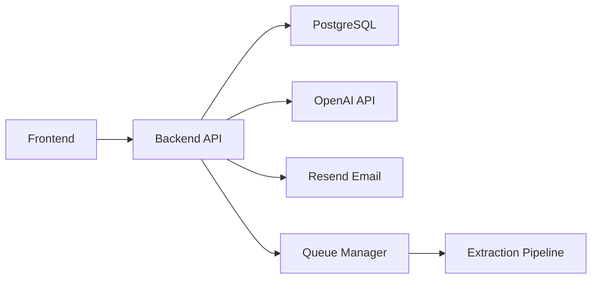

# Extractable Documentation

Welcome to the Extractable documentation! This directory contains comprehensive guides for understanding, developing, and deploying the Extractable platform.

## Documentation Index

### 📚 Core Documentation

- **[Architecture](./architecture.md)** - System architecture, component diagrams, and technical overview
- **[API Documentation](./api.md)** - Complete API reference with examples
- **[Development Guide](./development.md)** - Setup, development workflow, and best practices
- **[Deployment Guide](./deployment.md)** - Production deployment instructions
- **[API Versioning](./api-versioning.md)** - API versioning strategy and migration guide
- **[Changelog](./CHANGELOG.md)** - Version history and release notes

## Quick Navigation

### For Developers

1. **Getting Started**: Start with [Development Guide](./development.md)
2. **Understanding the System**: Read [Architecture](./architecture.md)
3. **API Integration**: See [API Documentation](./api.md)
4. **Contributing**: Follow guidelines in [Development Guide](./development.md)

### For DevOps

1. **Deployment**: Follow [Deployment Guide](./deployment.md)
2. **Architecture**: Understand infrastructure in [Architecture](./architecture.md)
3. **Monitoring**: See deployment guide for monitoring setup

### For API Users

1. **API Reference**: See [API Documentation](./api.md)
2. **Authentication**: See authentication section in API docs
3. **Examples**: Check code examples in API documentation

## Documentation Structure

```text
docs/
├── README.md              # This file - documentation index
├── architecture.md        # System architecture and design
├── api.md                 # API reference and examples
├── development.md         # Development setup and workflow
├── deployment.md         # Production deployment guide
├── api-versioning.md     # API versioning strategy
└── CHANGELOG.md          # Version history
```

## Key Concepts

### System Overview

Extractable is a SaaS platform for extracting structured tables from PDFs and images using OpenAI's GPT models. The system consists of:

- **Frontend**: React application with TypeScript
- **Backend**: FastAPI application with PostgreSQL
- **Queue System**: Priority-based job queue
- **Real-time Updates**: Server-Sent Events (SSE)
- **Email Service**: Transactional emails via Resend

### Architecture Highlights



### Key Features

- ✅ Priority-based extraction queue
- ✅ Real-time status updates via SSE
- ✅ Multi-step validation pipeline
- ✅ JWT authentication
- ✅ Email notifications
- ✅ Multiple output formats (JSON, CSV, Excel)
- ✅ User profile management
- ✅ Password reset functionality

## Getting Help

### Documentation Issues

If you find errors or missing information in the documentation:

1. Check if the information exists in another document
2. Review the [TODO.md](../TODO.md) for planned features
3. Create an issue or pull request with improvements

### Common Questions

**Q: How do I set up the development environment?**  
A: See [Development Guide](./development.md#quick-start)

**Q: How do I deploy to production?**  
A: See [Deployment Guide](./deployment.md)

**Q: How do I use the API?**  
A: See [API Documentation](./api.md)

**Q: What's the system architecture?**  
A: See [Architecture](./architecture.md)

## Contributing to Documentation

We welcome contributions to improve the documentation! When contributing:

1. Follow the existing documentation style
2. Use Mermaid diagrams where appropriate
3. Include code examples
4. Keep documentation up-to-date with code changes
5. Test all code examples

## Documentation Standards

### Code Examples

- Include complete, runnable examples
- Show error handling
- Use realistic data
- Include multiple languages when relevant (Python, JavaScript, cURL)

### Diagrams

- Use Mermaid for diagrams
- Keep diagrams simple and clear
- Include legends when needed
- Update diagrams when architecture changes

### Writing Style

- Use clear, concise language
- Include step-by-step instructions
- Add troubleshooting sections
- Link related documentation

## Related Resources

- **Project README**: [../README.md](../README.md)
- **TODO List**: [../TODO.md](../TODO.md)
- **API Interactive Docs**: `https://api.extractable.in/docs` (production)
- **GitHub Repository**: Check repository for latest code

## Version Information

- **Current API Version**: v1
- **Documentation Version**: 1.0.0
- **Last Updated**: 2024-01-01

## TODO: Documentation Improvements

See [TODO.md](../TODO.md) for planned documentation enhancements:

- [ ] Add video tutorials
- [ ] Create interactive API playground
- [ ] Add more code examples
- [ ] Create architecture decision records (ADRs)
- [ ] Add troubleshooting guides
- [ ] Create migration guides for major updates
