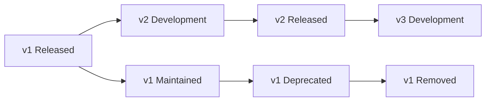
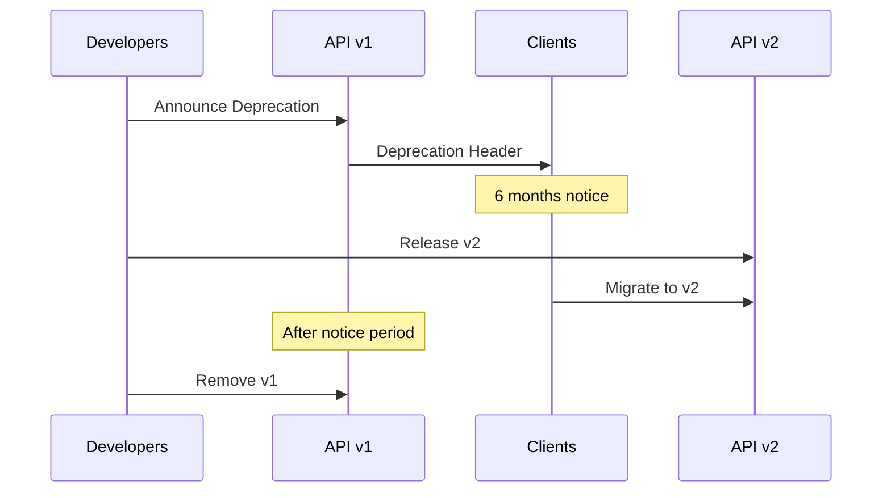
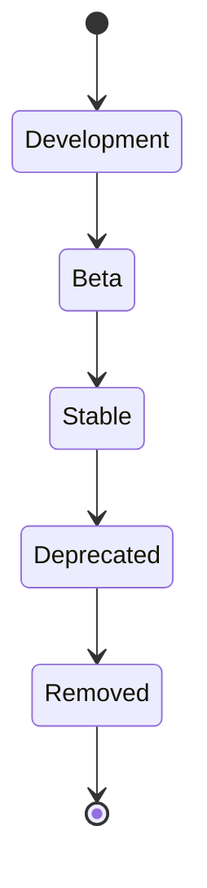

# API Versioning Strategy

## Overview

Extractable uses URL path-based API versioning to maintain backward compatibility while allowing iterative development and breaking changes. This strategy ensures that existing clients continue to work while new features and improvements can be introduced.

## Version Format

API versions are specified in the URL path:

```text
/api/v1/extractions
/api/v2/extractions  (future)
```

## Version Detection

Clients can check available versions and the current version:

```http
GET /api/versions
```

**Response:**

```json
{
  "current_version": "v1",
  "supported_versions": ["v1"]
}
```

## Current Versions

### v1 (Current Stable)

- **Status**: Active
- **Release Date**: 2024-01-01
- **End of Life**: TBD
- **Base URL**: `/api/v1`

**Features:**

- User authentication (register, login, refresh)
- Password reset (forgot, reset)
- User profile management
- Extraction CRUD operations
- Priority-based queue system
- Real-time status updates (SSE)
- Multiple output formats (JSON, CSV, Excel)
- Rate limiting
- Pagination

## Versioning Policy

### Backward Compatibility



**Principles:**

- At least one previous version is maintained
- Breaking changes require a new version
- Deprecation warnings in response headers
- Minimum 6 months notice before removal

### Breaking Changes

A breaking change requires a new version:

- **Removing endpoints** or changing HTTP methods
- **Removing required fields** from request/response
- **Changing field types** (e.g., string to number)
- **Changing authentication** requirements
- **Removing response fields** that clients depend on
- **Changing error response** formats

### Non-Breaking Changes

These can be added to existing versions:

- **Adding new endpoints**
- **Adding optional fields** to requests/responses
- **Adding new response fields**
- **Improving error messages** (same format)
- **Performance improvements**
- **Bug fixes** that don't change behavior

## Deprecation Process



### Deprecation Timeline

1. **Announcement** (Month 0)
   - Add deprecation header to responses
   - Update documentation
   - Notify API users

2. **Notice Period** (Months 1-6)
   - Continue supporting deprecated version
   - Provide migration guides
   - Answer questions and support migration

3. **Removal** (Month 7+)
   - Remove deprecated version
   - Update version detection endpoint

### Deprecation Headers

Deprecated endpoints include:

```http
Deprecation: true
Sunset: Sat, 01 Jul 2024 00:00:00 GMT
Link: <https://api.extractable.in/api/v2/extractions>; rel="successor-version"
```

## Adding New Versions

### Step-by-Step Process

1. **Create Version Directory**

   ```bash
   mkdir -p backend/app/api/v2/routes
   ```

2. **Copy Base Structure**

   ```bash
   cp -r backend/app/api/v1/* backend/app/api/v2/
   ```

3. **Update Version Configuration**

   ```python
   # backend/app/api/versioning.py
   CURRENT_VERSION = "v2"
   SUPPORTED_VERSIONS = ["v1", "v2"]
   ```

4. **Modify Routes**
   - Update routes as needed
   - Maintain backward compatibility where possible
   - Document breaking changes

5. **Update Router**

   ```python
   # backend/app/api/v2/router.py
   router = APIRouter(prefix="/api/v2", tags=["v2"])
   ```

6. **Register in Main App**

   ```python
   # backend/app/main.py
   from app.api.v2.router import router as v2_router
   app.include_router(v2_router)
   ```

7. **Update Documentation**
   - API documentation
   - Migration guides
   - Changelog

8. **Deploy**
   - Deploy alongside existing version
   - Monitor for issues
   - Support both versions during transition

## Migration Guide

### From v1 to v2 (Example)

When v2 is released, follow these steps:

#### 1. Review Changelog

Check the [CHANGELOG.md](./CHANGELOG.md) for:

- Breaking changes
- New features
- Deprecated endpoints
- Migration requirements

#### 2. Update API Client

**Before (v1):**

```python
BASE_URL = "https://api.extractable.in/api/v1"
```

**After (v2):**

```python
BASE_URL = "https://api.extractable.in/api/v2"
```

#### 3. Update Request/Response Models

**Example - Changed Response Format:**

**v1:**

```json
{
  "id": 1,
  "status": "completed"
}
```

**v2:**

```json
{
  "id": 1,
  "status": "completed",
  "metadata": {
    "processing_time": 45.2
  }
}
```

#### 4. Test Thoroughly

- Test all endpoints
- Verify error handling
- Check authentication
- Validate data formats

#### 5. Deploy Updated Client

- Deploy to staging first
- Monitor for errors
- Deploy to production
- Keep v1 client as fallback

## Version Lifecycle



## Best Practices

### For API Developers

1. **Plan Breaking Changes**
   - Group breaking changes together
   - Minimize version proliferation
   - Consider impact on clients

2. **Document Changes**
   - Clear changelog entries
   - Migration guides
   - Code examples

3. **Maintain Compatibility**
   - Support multiple versions simultaneously
   - Test version coexistence
   - Monitor version usage

4. **Communicate Changes**
   - Announce deprecations early
   - Provide migration timelines
   - Support during migration

### For API Clients

1. **Always Specify Version**

   ```python
   # Good
   BASE_URL = "https://api.extractable.in/api/v1"
   
   # Bad
   BASE_URL = "https://api.extractable.in/api"
   ```

2. **Monitor Deprecation Headers**

   ```python
   response = requests.get(url)
   if response.headers.get('Deprecation') == 'true':
       sunset = response.headers.get('Sunset')
       print(f"API deprecated. Sunset: {sunset}")
   ```

3. **Plan Migrations**
   - Review changelogs regularly
   - Test new versions in staging
   - Migrate before deprecation

4. **Handle Version Errors**

   ```python
   try:
       response = requests.get(f"{BASE_URL}/extractions")
   except requests.exceptions.HTTPError as e:
       if e.response.status_code == 404:
           # Version might not exist
           check_available_versions()
   ```

5. **Use Version Detection**

   ```python
   def get_current_version():
       response = requests.get("https://api.extractable.in/api/versions")
       return response.json()["current_version"]
   ```

## Version Comparison

| Aspect | v1 | v2 (Future) |
| --- | --- | --- |
| Status | Stable | Planned |
| Authentication | JWT | JWT + OAuth2 |
| Extractions | Basic | Enhanced |
| Queue | Priority-based | Priority + Scheduling |
| Notifications | SSE | SSE + Webhooks |
| Output Formats | JSON, CSV, Excel | + Parquet, XML |

## FAQ

### Q: How long are versions supported?

A: At least 6 months after deprecation announcement, typically 12+ months total.

### Q: Can I use multiple versions simultaneously?

A: Yes, you can make requests to different versions in the same application.

### Q: What happens if I don't migrate?

A: Deprecated versions are eventually removed. You'll need to migrate to continue using the API.

### Q: How do I know when to migrate?

A: Monitor deprecation headers and check the changelog regularly.

### Q: Are there migration tools?

A: Migration guides and examples are provided in documentation. Automated migration tools may be available for specific versions.

## TODO: Versioning Improvements

See [TODO.md](../../TODO.md) for planned versioning enhancements:

- [ ] Automated migration tools
- [ ] Version usage analytics
- [ ] Deprecation dashboard
- [ ] Client SDK version management
- [ ] GraphQL API with versioning
- [ ] API version negotiation

## Resources

- [API Documentation](./api.md) - Complete API reference
- [Changelog](./CHANGELOG.md) - Version history
- [Development Guide](./development.md) - Contributing guidelines
