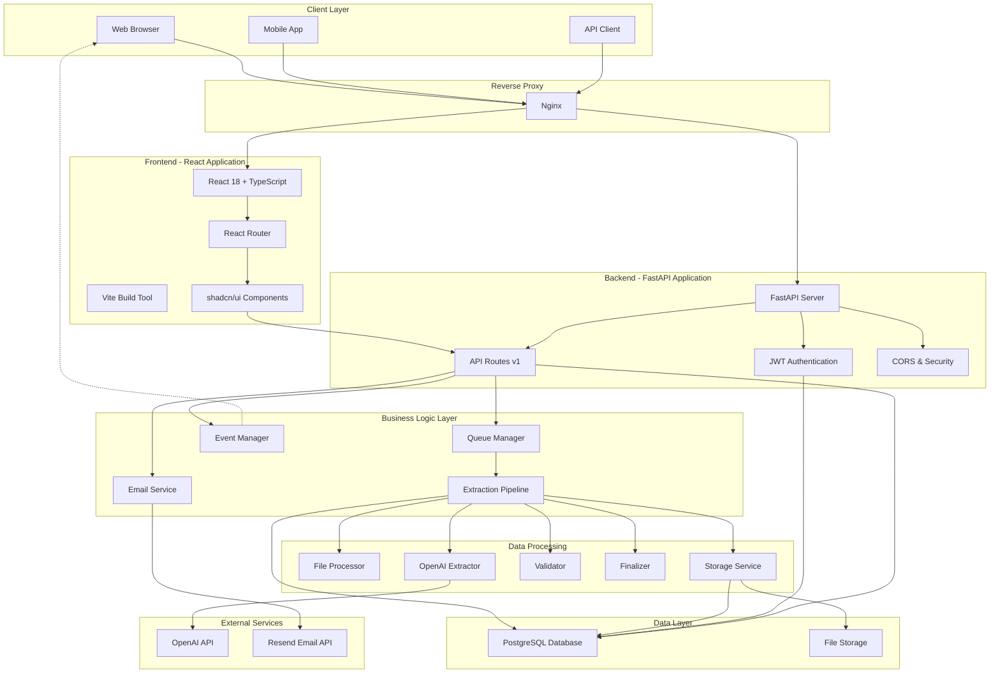
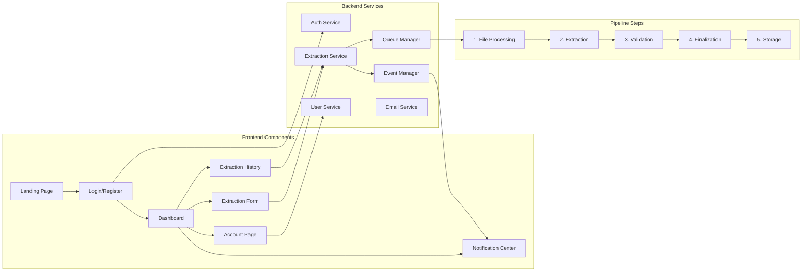
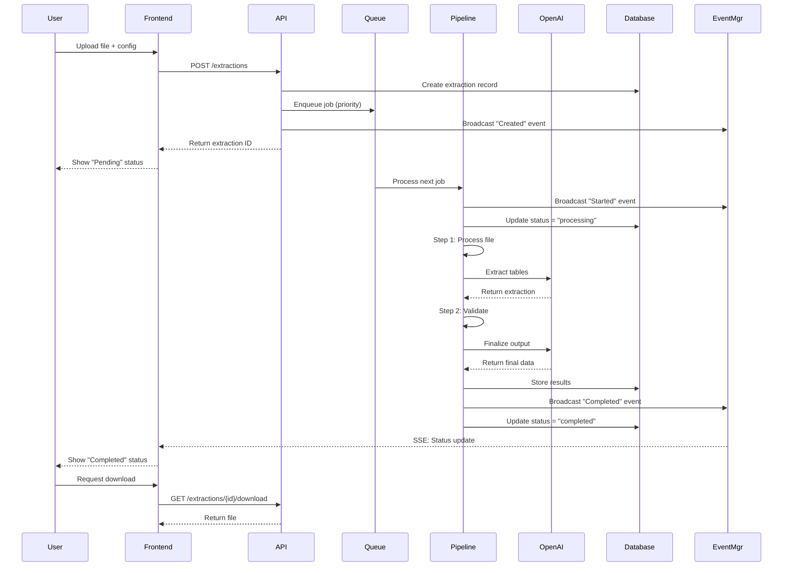
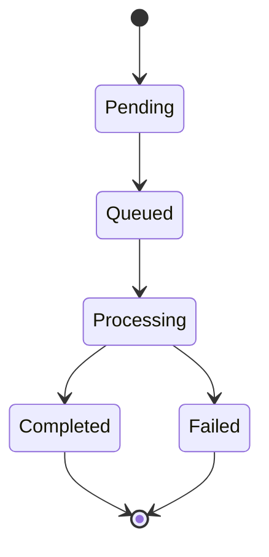
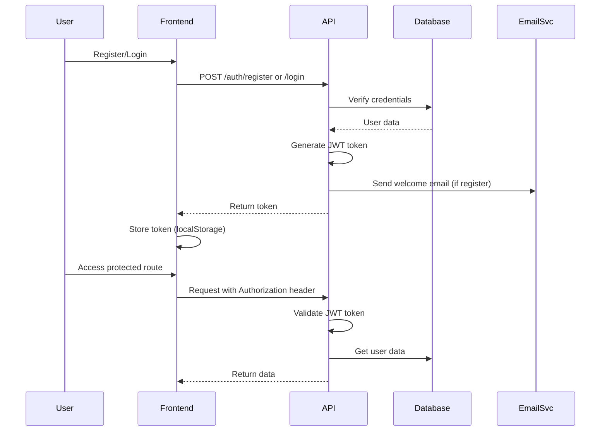
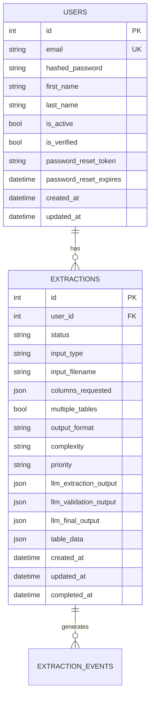

# System Architecture

## Overview

Extractable is a production-grade SaaS platform for extracting structured tables from PDFs and images using OpenAI's GPT models. The system follows a multi-step validation pipeline to ensure accurate extraction, with a priority-based queue system for job management and real-time notifications.

## System Architecture Diagram

## Component Architecture

## Data Flow - Extraction Pipeline

## Queue Management System

## Authentication Flow

## Database Schema

## Technology Stack

### Frontend

- **React 18+** with TypeScript - Modern UI framework
- **Vite** - Fast build tool and dev server
- **shadcn/ui** - High-quality component library
- **Tailwind CSS** - Utility-first CSS framework
- **React Router** - Client-side routing
- **Axios** - HTTP client for API calls
- **Zustand** - State management
- **Sonner** - Toast notifications

### Backend

- **FastAPI** - Modern Python web framework
- **PostgreSQL** - Relational database
- **SQLAlchemy** - ORM for database operations
- **Alembic** - Database migration tool
- **Pydantic** - Data validation and settings
- **JWT** - Authentication tokens
- **Polars** - Fast data manipulation library
- **Uvicorn** - ASGI server

### External Services

- **OpenAI API** - GPT models for table extraction
- **Resend** - Transactional email service

### Infrastructure

- **Docker & Docker Compose** - Containerization
- **Nginx** - Reverse proxy and static file serving
- **Let's Encrypt** - SSL certificates

## Key Features

### 1. Priority-Based Queue System

- Per-user queues ensure only one extraction runs at a time
- Priority levels: High, Medium, Low
- Automatic queue processing with background tasks

### 2. Real-Time Notifications

- Server-Sent Events (SSE) for real-time updates
- Frontend polling fallback for status changes
- Toast notifications for user feedback

### 3. Multi-Step Extraction Pipeline

1. **File Processing**: Convert PDFs to images or process image files
2. **Extraction**: Extract tables using OpenAI GPT models
3. **Validation**: Validate extractions with context awareness
4. **Finalization**: Generate consolidated output addressing validation issues
5. **Storage**: Convert to requested format (JSON/CSV/Excel) and store

### 4. Email Integration

- Welcome emails on registration
- Password reset emails
- Configurable email addresses and reply-to

### 5. User Management

- JWT-based authentication
- User profiles with first/last name
- Password reset functionality
- Account management

## Security Features

- **JWT Authentication**: Stateless token-based auth
- **Password Hashing**: Bcrypt for secure password storage
- **CORS Configuration**: Controlled cross-origin requests
- **Input Validation**: Pydantic schemas for request validation
- **Rate Limiting**: Per-user rate limits (RPM, TPM, RPD)
- **HTTPS**: SSL/TLS encryption in production
- **Security Headers**: XSS protection, frame options, etc.

## Storage Architecture

- **Input Files**: Processed in memory, not stored
- **Output Files**: Stored as JSON in database (table_data column)
- **LLM Responses**: Stored in database for audit trail
- **User Data**: Stored in PostgreSQL with proper indexing

## API Versioning

- URL path-based versioning: `/api/v1/`
- Supports multiple versions simultaneously
- Backward compatibility maintained
- Version detection endpoint: `/api/versions`

## Performance Considerations

- **Async Processing**: Background tasks for extraction jobs
- **Queue Management**: Prevents resource exhaustion
- **Database Indexing**: Optimized queries for user data
- **Caching**: Frontend asset caching via Nginx
- **Connection Pooling**: SQLAlchemy connection pool

## Scalability

- **Horizontal Scaling**: Stateless backend design
- **Database Scaling**: Can use managed PostgreSQL services
- **Load Balancing**: Nginx can distribute traffic
- **Background Jobs**: Queue system handles concurrent requests

## Monitoring & Observability

- **Health Checks**: `/health` endpoint for monitoring
- **Logging**: Structured logging throughout the application
- **Error Tracking**: Exception handling with detailed logs
- **Status Tracking**: Real-time extraction status updates

## Future Enhancements

See [TODO.md](../../TODO.md) for planned features including:

- Email notifications for extraction jobs
- Email verification
- Table editing capabilities
- Sharing and collaboration
- Vendor API for integrations
- Pricing tiers and gated services
