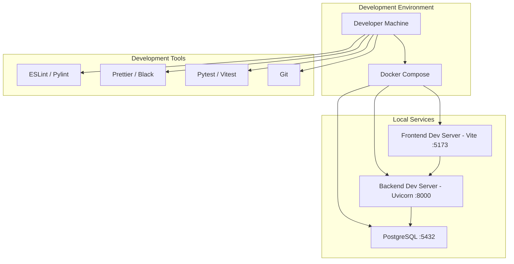
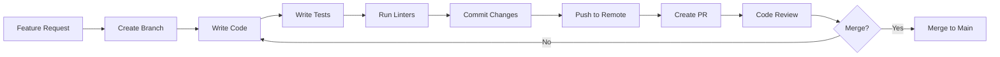

# Development Guide

## Overview

This guide covers setting up the Extractable development environment, understanding the codebase structure, and contributing to the project.

## Development Architecture



## Prerequisites

- **Python 3.11+** - Backend runtime
- **Node.js 18+** - Frontend runtime
- **Docker & Docker Compose** - Containerization
- **Git** - Version control
- **PostgreSQL client tools** (optional) - Database management

## Quick Start

### 1. Clone Repository

```bash
git clone <repository-url> extractable
cd extractable
```

### 2. Environment Setup

#### Backend Environment

Create `backend/.env`:

```bash
# Database
POSTGRES_HOST=postgres
POSTGRES_USER=extractable_user
POSTGRES_PASSWORD=extractable_password
POSTGRES_DB=extractable_db

# JWT
SECRET_KEY=dev-secret-key-change-in-production
ACCESS_TOKEN_EXPIRE_MINUTES=30

# OpenAI
OPENAI_API_KEY=your-openai-api-key
OPENAI_SIMPLE_MODEL=gpt-5-nano
OPENAI_REGULAR_MODEL=gpt-5-mini
OPENAI_COMPLEX_MODEL=gpt-5

# CORS
CORS_ORIGINS=http://localhost:5173,http://localhost:3000

# Frontend URL
FRONTEND_URL=http://localhost:5173

# Email (Resend)
RESEND_API_KEY=your-resend-api-key
RESEND_DEFAULT_FROM_EMAIL=Extractable <no-reply@extractable.in>
RESEND_FOUNDER_EMAIL=Chitresh Gyanani <chitresh.gyanani@extractable.in>
RESEND_REPLY_TO=support@extractable.in

# Rate Limiting
RATE_LIMIT_RPM=60
RATE_LIMIT_TPM=32000
RATE_LIMIT_RPD=1500
```

#### Frontend Environment

Create `frontend/.env.local`:

```bash
VITE_API_BASE_URL=http://localhost:8000/api/v1
```

### 3. Start Development Services

#### Option A: Docker Compose (Recommended)

```bash
# Start all services
docker-compose up -d

# Run migrations
docker-compose exec backend alembic upgrade head

# View logs
docker-compose logs -f
```

Access:

- Frontend: <http://localhost:3000>
- Backend: <http://localhost:8000>
- API Docs: <http://localhost:8000/docs>

#### Option B: Local Development

**Backend:**

```bash
cd backend

# Create virtual environment
python -m venv venv
source venv/bin/activate  # Windows: venv\Scripts\activate

# Install dependencies
pip install -r requirements.txt

# Start PostgreSQL (via Docker)
docker-compose up -d postgres

# Run migrations
alembic upgrade head

# Start development server
uvicorn app.main:app --reload --host 0.0.0.0 --port 8000
```

**Frontend:**

```bash
cd frontend

# Install dependencies
npm install

# Start development server
npm run dev
```

Access:

- Frontend: <http://localhost:5173>
- Backend: <http://localhost:8000>

## Project Structure

```text
extractable/
├── backend/
│   ├── app/
│   │   ├── api/              # API routes and middleware
│   │   │   ├── v1/          # API version 1
│   │   │   │   └── routes/  # Route handlers
│   │   │   ├── middleware.py # CORS, security
│   │   │   └── versioning.py # API versioning
│   │   ├── core/            # Core configuration
│   │   │   ├── config.py    # Settings management
│   │   │   ├── database.py  # Database connection
│   │   │   └── security.py  # JWT, password hashing
│   │   ├── models/          # Database models
│   │   │   ├── user.py      # User model
│   │   │   ├── extraction.py # Extraction model
│   │   │   ├── schemas.py   # Pydantic schemas
│   │   │   └── enums.py     # Enumerations
│   │   ├── pipeline/        # Extraction pipeline
│   │   │   └── extraction_pipeline.py
│   │   ├── services/        # Business logic
│   │   │   ├── queue_manager.py    # Job queue
│   │   │   ├── event_manager.py    # SSE events
│   │   │   ├── email_service.py    # Email sending
│   │   │   ├── file_processor.py   # File handling
│   │   │   ├── extractor.py        # OpenAI extraction
│   │   │   ├── validator.py        # Validation
│   │   │   ├── finalizer.py         # Final output
│   │   │   └── storage_service.py  # Data storage
│   │   ├── utils/           # Utilities
│   │   │   ├── file_utils.py
│   │   │   └── polars_converter.py
│   │   ├── dependencies.py # FastAPI dependencies
│   │   └── main.py         # Application entry point
│   ├── alembic/            # Database migrations
│   │   └── versions/      # Migration files
│   ├── Dockerfile          # Backend container
│   ├── requirements.txt    # Python dependencies
│   └── run.sh             # Production startup script
│
├── frontend/
│   ├── src/
│   │   ├── components/    # React components
│   │   │   ├── auth/      # Authentication components
│   │   │   ├── dashboard/ # Dashboard components
│   │   │   ├── extraction/ # Extraction components
│   │   │   ├── common/    # Shared components
│   │   │   └── ui/        # shadcn/ui components
│   │   ├── services/      # API clients
│   │   │   ├── api.ts     # Main API client
│   │   │   └── auth.ts    # Auth utilities
│   │   ├── hooks/         # Custom React hooks
│   │   ├── store/         # State management (Zustand)
│   │   ├── context/       # React context
│   │   ├── types/         # TypeScript types
│   │   └── lib/           # Utilities
│   ├── public/            # Static assets
│   ├── Dockerfile         # Frontend container
│   ├── nginx.conf         # Nginx configuration
│   └── package.json       # Node dependencies
│
├── docs/                  # Documentation
├── docker-compose.yml     # Development Docker Compose
└── README.md             # Project README
```

## Development Workflow

### Code Organization



### Branch Strategy

- `main` - Production-ready code
- `dev` - Development branch
- `feature/*` - Feature branches
- `fix/*` - Bug fix branches
- `docs/*` - Documentation updates

### Creating a Feature

```bash
# Create feature branch
git checkout -b feature/my-feature

# Make changes
# ... edit files ...

# Run tests
cd backend && pytest
cd ../frontend && npm test

# Run linters
cd backend && pylint app/
cd ../frontend && npm run lint

# Commit
git add .
git commit -m "feat: add my feature"

# Push and create PR
git push origin feature/my-feature
```

## Database Migrations

### Create Migration

```bash
cd backend

# Auto-generate migration
alembic revision --autogenerate -m "description of changes"

# Manual migration
alembic revision -m "description of changes"
```

### Apply Migration

```bash
# Apply all pending migrations
alembic upgrade head

# Apply specific migration
alembic upgrade <revision>

# Rollback one migration
alembic downgrade -1

# Rollback to specific revision
alembic downgrade <revision>
```

### Migration Best Practices

1. Always review auto-generated migrations
2. Test migrations on development database first
3. Never edit existing migrations (create new ones)
4. Include both `upgrade` and `downgrade` functions
5. Test rollback procedures

## Testing

### Backend Tests

```bash
cd backend

# Run all tests
pytest

# Run specific test file
pytest tests/test_auth.py

# Run with coverage
pytest --cov=app --cov-report=html

# Run specific test
pytest tests/test_auth.py::test_login
```

### Frontend Tests

```bash
cd frontend

# Run tests
npm test

# Run with coverage
npm test -- --coverage

# Run in watch mode
npm test -- --watch
```

### Test Structure

```text
backend/
└── tests/
    ├── test_auth.py
    ├── test_extractions.py
    └── test_users.py

frontend/
└── src/
    └── __tests__/
        ├── components/
        └── services/
```

## Code Style

### Backend (Python)

- Follow **PEP 8** style guide
- Use **type hints** for all functions
- Add **docstrings** for all classes and functions
- Maximum line length: 100 characters
- Use **Black** for formatting (optional)

**Example:**

```python
from typing import Optional, List
from sqlalchemy.orm import Session

def get_user_by_email(
    db: Session, 
    email: str
) -> Optional[User]:
    """
    Get user by email address.
    
    Args:
        db: Database session
        email: User email address
        
    Returns:
        User object if found, None otherwise
    """
    return db.query(User).filter(User.email == email).first()
```

### Frontend (TypeScript/React)

- Follow **ESLint** rules
- Use **TypeScript strict mode**
- Use **functional components** with hooks
- Use **Prettier** for formatting (optional)

**Example:**

```typescript
import { useState } from 'react';

interface User {
  id: number;
  email: string;
}

export function UserProfile({ userId }: { userId: number }) {
  const [user, setUser] = useState<User | null>(null);
  
  // Component logic
  
  return <div>{/* JSX */}</div>;
}
```

## Debugging

### Backend Debugging

**VS Code Launch Configuration:**

```json
{
  "version": "0.2.0",
  "configurations": [
    {
      "name": "Python: FastAPI",
      "type": "python",
      "request": "launch",
      "program": "${workspaceFolder}/backend",
      "module": "uvicorn",
      "args": [
        "app.main:app",
        "--reload",
        "--host",
        "0.0.0.0",
        "--port",
        "8000"
      ],
      "jinja": true,
      "justMyCode": true
    }
  ]
}
```

**Debugging Tips:**

- Use `logging` module for debug output
- Set breakpoints in VS Code
- Use `pdb` for interactive debugging:
  
  ```python
  import pdb; pdb.set_trace()
  ```

### Frontend Debugging

**Browser DevTools:**

- React DevTools extension
- Network tab for API calls
- Console for errors and logs

**VS Code Debugging:**

- Use Chrome Debugger extension
- Set breakpoints in TypeScript files

## Common Tasks

### Adding a New API Endpoint

1. **Create route handler** in `backend/app/api/v1/routes/`
2. **Add to router** in `backend/app/api/v1/router.py`
3. **Create Pydantic schemas** in `backend/app/models/schemas.py`
4. **Update API documentation** in `docs/api.md`
5. **Add frontend API client** method in `frontend/src/services/api.ts`
6. **Create frontend component** if needed

### Adding a New Database Model

1. **Create model** in `backend/app/models/`
2. **Create migration**: `alembic revision --autogenerate -m "add model"`
3. **Review migration** file
4. **Apply migration**: `alembic upgrade head`
5. **Create Pydantic schemas** for API

### Adding a New Frontend Component

1. **Create component** in `frontend/src/components/`
2. **Add to appropriate directory** (auth, dashboard, etc.)
3. **Use shadcn/ui components** when possible
4. **Add TypeScript types** in `frontend/src/types/`
5. **Update routing** if needed

## Environment Variables

### Backend Variables

| Variable | Description | Default |
| --- | --- | --- |
| `POSTGRES_HOST` | Database host | `localhost` |
| `POSTGRES_USER` | Database user | `extractable_user` |
| `POSTGRES_PASSWORD` | Database password | - |
| `POSTGRES_DB` | Database name | `extractable_db` |
| `SECRET_KEY` | JWT secret key | - |
| `OPENAI_API_KEY` | OpenAI API key | - |
| `CORS_ORIGINS` | Allowed CORS origins | `http://localhost:5173` |
| `FRONTEND_URL` | Frontend URL | `http://localhost:5173` |
| `RESEND_API_KEY` | Resend API key | - |

### Frontend Variables

| Variable | Description | Default |
| --- | --- | --- |
| `VITE_API_BASE_URL` | Backend API URL | `http://localhost:8000/api/v1` |

## Troubleshooting

### Database Connection Issues

```bash
# Check PostgreSQL is running
docker-compose ps postgres

# Check connection
docker-compose exec postgres psql -U extractable_user -d extractable_db

# Reset database (WARNING: deletes all data)
docker-compose down -v
docker-compose up -d postgres
alembic upgrade head
```

### Port Already in Use

```bash
# Find process using port
lsof -i :8000  # Backend
lsof -i :5173  # Frontend

# Kill process
kill -9 <PID>
```

### Migration Conflicts

```bash
# Check current migration
alembic current

# Check migration history
alembic history

# Resolve conflicts manually
# Edit migration files as needed
```

### Frontend Build Issues

```bash
# Clear cache
rm -rf node_modules
rm -rf .vite
npm install

# Check Node version
node --version  # Should be 18+

# Clear npm cache
npm cache clean --force
```

## Performance Optimization

### Backend

- Use database indexes for frequently queried columns
- Implement connection pooling
- Cache expensive operations
- Use async/await for I/O operations
- Profile with `cProfile` or `py-spy`

### Frontend

- Code splitting with React.lazy()
- Optimize bundle size
- Use React.memo() for expensive components
- Implement virtual scrolling for large lists
- Optimize images and assets

## Contributing

1. **Fork the repository**
2. **Create a feature branch**
3. **Make your changes**
4. **Write/update tests**
5. **Update documentation**
6. **Run linters and tests**
7. **Submit a pull request**

### Commit Message Format

```text
<type>: <subject>

<body>

<footer>
```

**Types:**

- `feat`: New feature
- `fix`: Bug fix
- `docs`: Documentation
- `style`: Code style changes
- `refactor`: Code refactoring
- `test`: Test additions/changes
- `chore`: Maintenance tasks

## Resources

- [FastAPI Documentation](https://fastapi.tiangolo.com/)
- [React Documentation](https://react.dev/)
- [TypeScript Documentation](https://www.typescriptlang.org/)
- [SQLAlchemy Documentation](https://docs.sqlalchemy.org/)
- [Alembic Documentation](https://alembic.sqlalchemy.org/)

## TODO: Development Improvements

See [TODO.md](../../TODO.md) for planned development enhancements:

- [ ] Add comprehensive test coverage
- [ ] Set up CI/CD pipeline
- [ ] Add pre-commit hooks
- [ ] Improve error handling and logging
- [ ] Add performance monitoring
- [ ] Create development Docker Compose override
